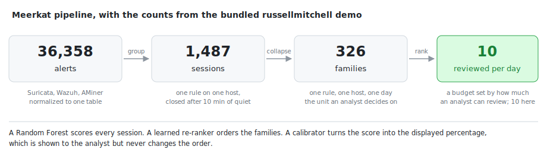
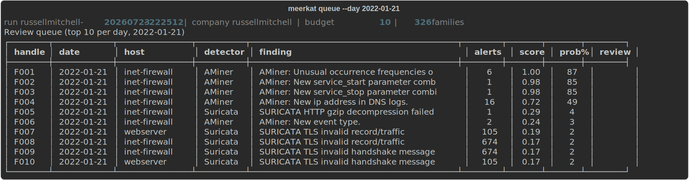
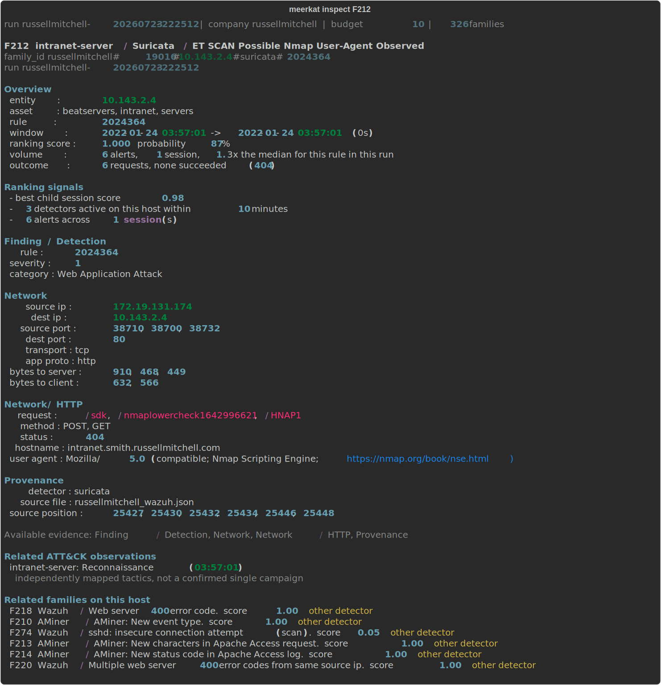
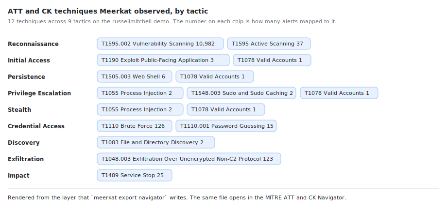

<p align="center">
  
</p>

<h1 align="center">Meerkat</h1>

<p align="center">
  <strong>ML-assisted alert triage for multi-detector SOC data.</strong>
</p>

## Overview

Security operations centres can receive more alerts than analysts have time to
review. Once a detector has raised an alert, the next problem is deciding which
activity deserves attention first.

Meerkat reads alerts from Wazuh, Suricata and AMiner, normalizes their different
formats, groups repeated activity and ranks the resulting cases. It produces a
bounded daily review queue while keeping the original evidence and MITRE ATT&CK
context available for investigation.

Instead of ranking isolated alerts, Meerkat ranks **families**. For example, one
Wazuh rule firing 7,068 times on the same host during one day becomes one family
to investigate rather than 7,068 separate decisions.

<p align="center">
  
</p>

- A **session** contains one detector rule firing on one host until that stream
  stays quiet for more than ten minutes.
- A **family** joins same-day sessions with the same host, detector and rule.
- A **budget** is the number of families the analyst can review per day.

Meerkat ranks families because the queue still needs an order, but ranking is
the mechanism rather than the final objective. Offline evaluation asks how many
different labelled attack windows are represented within the review budget,
instead of rewarding a queue for repeatedly surfacing one high-volume phase.
This models the practical Tier 1 question: with limited time, how many distinct
suspicious activities did the queue expose?

On the bundled example, Meerkat reduces 36,358 alerts to 1,487 sessions and 326
families. With a budget of 10, it presents the top 10 families for each of the
four days in the scenario.

## How it works

Meerkat uses two small ML layers:

1. A Random Forest scores each session from its volume, duration, detector,
   standardized severity, rule rarity, ATT&CK presence and asset context.
2. A logistic re-ranker combines the child-session scores and family-level
   context to order the final queue.

A separate calibrator turns the family score into an evidence percentage for
display. That percentage does not control the queue order and should not be read
as an analyst verdict.

Raw host names, IP addresses, rule IDs and alert names are not model features.
This prevents the model from simply memorizing one of the training companies.
An inventory is still used outside the model to identify the affected machine,
distinguish it from the observing sensor and attach asset roles.

The design separates detector-specific parsing from ranking. Once alerts share
the normalized schema, the models use portable measurements rather than raw
company identifiers, and every evaluation fold learns its vocabulary without
the unseen environment. This reduces dependence on one dataset or company, but
does not make the tool universally detector-agnostic: each new alert source
still needs a normalization adapter.

The project was informed by related work on SOC alert prioritization, grouping
and contextual analysis, including [TEQ](https://arxiv.org/abs/2302.06648),
[AIP](https://arxiv.org/abs/2607.16963),
[AlertBERT](https://arxiv.org/abs/2602.06534),
[RAPID](https://research.ibm.com/publications/rapid-real-time-alert-investigation-with-context-aware-prioritization-for-efficient-threat-discovery),
[AI2](https://people.csail.mit.edu/kalyan/AI2/) and
[DeepCASE](https://doi.org/10.1109/SP46214.2022.9833671).

## Quick start

Meerkat requires Python 3.11 or newer and Git LFS for the demo alerts.

```bash
git clone https://github.com/jiacwng/meerkat.git
cd meerkat
git lfs install
git lfs pull
python -m pip install -e .
meerkat demo
```

The demo uses a model trained on seven AIT-ADS environments and ranks
`russellmitchell` as the unseen eighth environment.

<p align="center">
  
</p>

The queue covers four days; the image shows the ten families selected for the
day the scripted attack runs.

The queue is saved as a run, so investigation commands do not score the data
again:

```bash
meerkat queue
meerkat inspect F003
meerkat inspect F003 S1
meerkat review F003 escalate --note "Unexpected service change"
meerkat export navigator
```

## Analyst workflow

| Command | Purpose |
|---|---|
| `meerkat triage --company C --input DIR --inventory FILE` | normalize and score one company's alert batch |
| `meerkat queue` | reopen the latest queue or filter all scored families |
| `meerkat inspect F003 [S1]` | inspect a family, one session or its original alerts |
| `meerkat review F003 escalate --note "..."` | record an escalation, benign finding or false positive |
| `meerkat export navigator` | export observed techniques as an ATT&CK Navigator layer |
| `meerkat train --holdout C` | train and save a reusable model bundle |
| `meerkat demo` | run the bundled held-out-company example |

A complete batch-to-review workflow looks like this:

```bash
meerkat triage --company russellmitchell --input data/raw --inventory data/raw/inventory/russellmitchell.json --budget 10
meerkat queue
meerkat inspect F003
meerkat inspect F003 S1 --raw --alerts 1
meerkat review F003 escalate --note "Unexpected service change"
```

The first command normalizes and ranks the new batch, then saves the run. The
remaining commands reopen that run, inspect one selected family and record the
analyst's decision without running the models again.

Useful queue filters include:

```bash
meerkat queue --all
meerkat queue --host intranet-server
meerkat queue --detector wazuh
meerkat queue --review-state escalate
```

Inspection starts with a summary rather than a raw alert dump. Evidence is
shown in consistent sections such as finding, identity, process, network, HTTP,
DNS, TLS and provenance. Empty sections are hidden.

<p align="center">
  
</p>

The view also lists other families on the same host and flags those raised by a
different detector, which is how corroborating activity is found.

```bash
meerkat inspect F218 --distinct http_status
meerkat inspect F218 --where http_status=403
meerkat inspect F218 --exclude http_status=404 --alerts 20
meerkat inspect F218 S1 --raw --alerts 1
```

Reviews are appended to `reviews.jsonl` inside the run directory. The most
recent entry is the current decision, while earlier entries remain available as
a small audit trail.

### ATT&CK context

`meerkat export navigator` writes the observed techniques as a layer file that
opens directly in the
[MITRE ATT&CK Navigator](https://mitre-attack.github.io/attack-navigator/). On
the demo run it covers 12 techniques across 9 tactics, built against Enterprise
ATT&CK 19.1.

<p align="center">
  
</p>

The spread across the kill chain is the useful signal here. The mapping supplies
investigation context and does not assert that these observations belong to a
single campaign.

## Evaluation

The evaluation uses all eight AIT-ADS environments. For each fold, seven
environments train the models and the eighth remains unseen. The training
vocabulary, model features, re-ranker and calibrator are all fitted without the
held-out environment.

The primary metric is **attack-window coverage at a fixed daily budget**. It
treats the selected queue as a set: ten near-identical families do not provide
the same coverage as ten families representing different attack activity.
Attack windows are known only during offline evaluation and never influence
runtime grouping, features, scores or queue selection.

AIT-ADS describes its scripted attack steps with labelled time windows. Meerkat
counts a window as **strictly reached** only when the daily queue contains an
officially event-labelled alert from that window.

```text
time -------------------------------------------------------------->

attack window            [=========================]
family F023         |-----------------------------------|
sessions             [ S1 ]       [ S2 ]        [ S3 ]
labelled alert                         *
```

The family groups related activity for one analyst decision. Its sessions split
that activity at quiet gaps. The family may extend beyond the attack window, but
strict coverage requires its labelled alert (`*`) to fall inside the window;
time overlap alone does not count.

| Ranking method | 5 | 10 | 25 |
|---|---:|---:|---:|
| **Learned family re-ranker** | **52** | **58** | **58** |
| Max child-session score | 44 | 53 | 58 |
| Family size (alert count) | 29 | 30 | 39 |
| Rule rarity, rarest first | 23 | 32 | 47 |
| Native detector severity | 19 | 33 | 46 |
| Random order | 17 | 29 | 43 |

The two model rows are totals across the eight held-out environments, averaged
over three random seeds with 200 trees. The four lower rows are unsupervised
orderings of exactly the same families under the same daily budget and the same
strict counting rule; they require no training, so every environment is scored
directly. Random order is averaged over three seeds.

Ranking by raw volume, rarity or the detectors' own severity is far behind at a
budget of five, which is where an analyst's day is actually decided.

The dataset contains 79 attack windows. Only 60 contain at least one official
event-labelled alert, so strict coverage cannot exceed 60 with this supervision.
At a budget of 10 families per day, the re-ranker reaches 58 of those 60
label-reachable windows.

Calibration reduces the pooled Brier score from 0.0301 to 0.0202 and improves
all 24 held-out environment and seed combinations. It improves how the displayed
percentage matches observed outcomes; it does not change the ranking.

The full experimental method, including rejected feature bundles and negative
results, is documented in
**[Meerkat: Ranking Alert Families for Capacity-Limited Triage](docs/report/meerkat.pdf)**.

## Dataset

Meerkat uses the
[AIT Alert Data Set](https://zenodo.org/records/8263181), built from eight
simulated company environments monitored by Wazuh, Suricata and AMiner. The
companion [AIT-ADS repository](https://github.com/ait-aecid/alert-data-set)
provides the detector configuration, asset configuration and per-alert labels.

The full experiment processes approximately **3.1 GB of source data** across
eight environments: 2,655,821 raw alert records, 2,349,098 alerts after
detector-duplicate removal, 1,817,250 event-labelled records and 79 scripted
attack windows.

The demo needs only the bundled `russellmitchell` raw files and pretrained
model. Reproducing the full cross-environment evaluation requires all eight
scenarios and the event-label files.

```text
data/raw/<company>_wazuh.json
data/raw/<company>_aminer.json
data/raw/alerts_csv/<company>_alerts.txt
data/raw/inventory/<company>.json
```

Inventories can be generated from the official `server_configs` directory:

```bash
python -m pip install PyYAML
python -m core.inventory ../alert-data-set/server_configs data/raw/inventory
```

## Project structure

```text
core/
  normalize.py       detector parsing and the shared alert schema
  inventory.py       entity and asset-role resolution
  sessions.py        session and family construction
  features.py        leakage-safe session features
  classifier.py      Random Forest, family re-ranker and calibration
  scenario_eval.py   leave-one-environment-out evaluation and model bundles
  attack_mapping.py  MITRE ATT&CK enrichment
  triage_policy.py   bounded daily queue

meerkat/
  cli.py             training, triage, inspection and review commands

models/               pretrained demo bundle
docs/                 report and project assets
```

## Future work

- Evaluate the ranking pipeline on
  [Microsoft GUIDE](https://www.kaggle.com/datasets/Microsoft/microsoft-security-incident-prediction/data)
  as a second benchmark. Its real-world incident evidence and analyst triage
  labels can test whether Meerkat transfers beyond AIT-ADS without replacing
  the current multi-detector evaluation.
- Add a browser interface over the same saved runs. The ranking and evaluation
  code will remain independent of the presentation layer.

## Scope and limitations

Meerkat is an experimental batch-triage tool. It does not replace a SIEM or
case-management platform.

- The results come from one simulated testbed whose environments share an attack
  script. They do not establish production performance.
- Triage is currently batch-based rather than streaming.
- Review state is local and single-user. There is no authentication, ownership
  assignment or multi-analyst locking.
- The current adapters cover Wazuh, Suricata and AMiner. A new detector still
  needs a parser that maps its fields and severity scale into Meerkat's schema.
- ATT&CK mappings provide investigation context. They do not prove that several
  observations belong to one attack campaign.

## License

Meerkat is released under the MIT License. AIT-ADS is distributed separately by
the Austrian Institute of Technology under CC BY 4.0.
