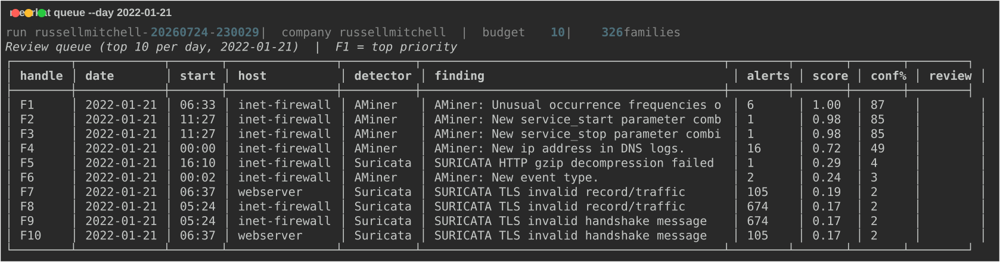
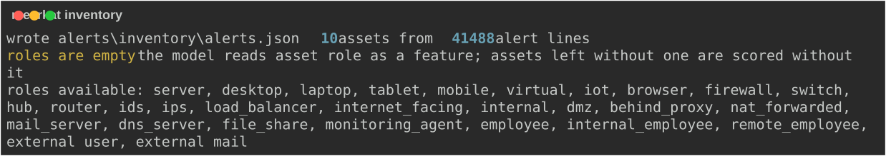
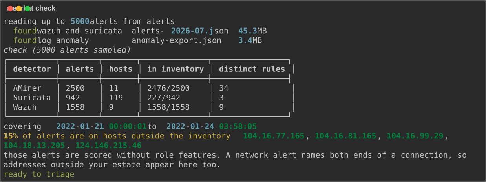
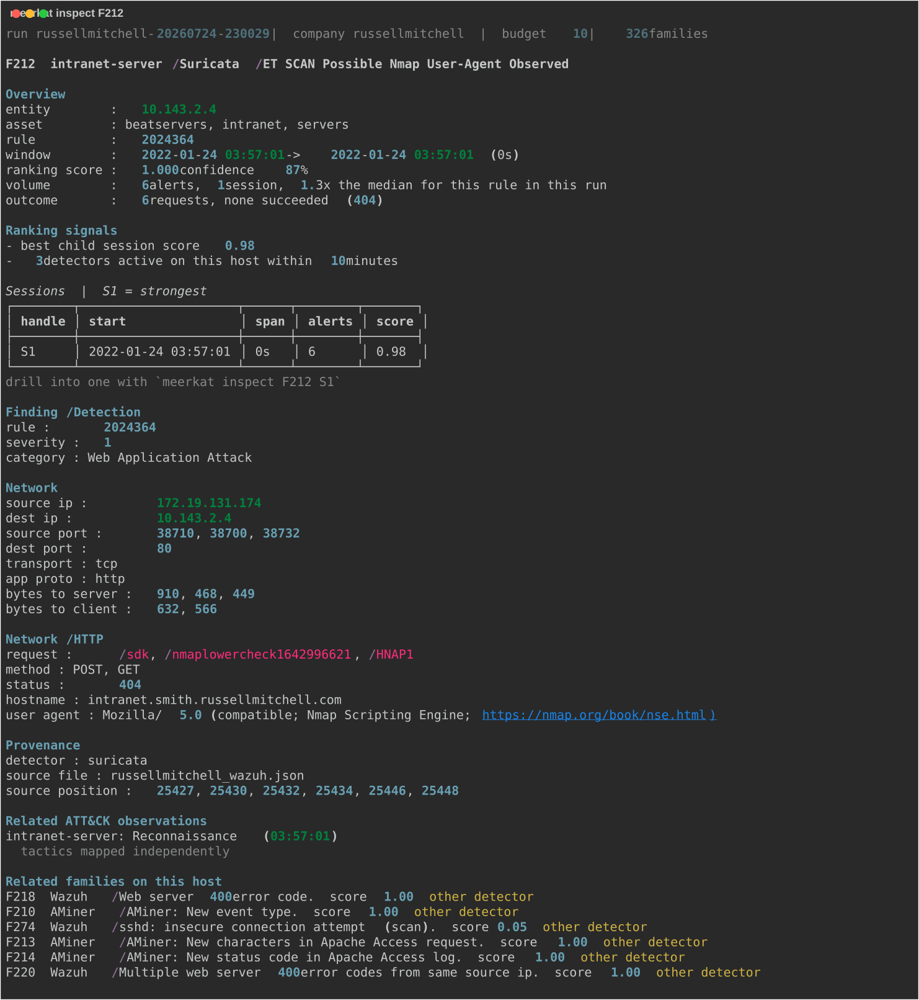
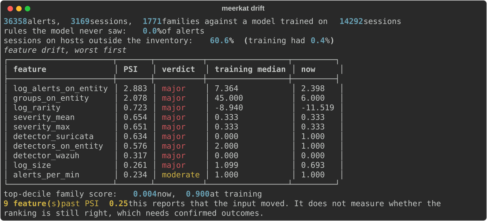
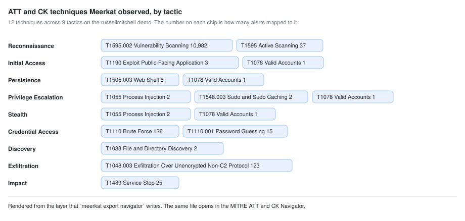

<p align="center">
  
</p>

<h1 align="center">meerkat</h1>

<p align="center">
  <strong>ML-assisted alert triage for multi-detector SOC data.</strong>
</p>

<p align="center">
  <a href="https://github.com/jiacwng/meerkat/actions/workflows/ci.yml">
    
  </a>
  
  
  
</p>

<p align="center">
  <a href="#quick-start">Quick start</a>
  &nbsp;&middot;&nbsp;
  <a href="#walkthrough">Walkthrough</a>
  &nbsp;&middot;&nbsp;
  <a href="#results">Results</a>
  &nbsp;&middot;&nbsp;
  <a href="docs/report/meerkat.pdf">Technical report</a>
</p>

## Overview

Wazuh, Suricata and a log anomaly detector each raise alerts on their own
severity scale, tens of thousands a day on a mid-sized network. None of them
ranks the others, so whoever looks first has to choose what to open.

> **Out of everything raised today, which alerts are the important ones?**

Ranking answers that by scoring alerts and sorting them. Meerkat adds one
assumption, and it is an assumption rather than a finding: the list is worked
until the reviewing time runs out, not to the end. How much time that is varies
by team, so it stays a number you set.

That changes the measure to **coverage at a budget**: for a given number of cases
opened, how much of the attack does the queue point at? Not every alert of it,
since one item is enough to start pulling the thread. What counts is whether
something in the queue leads to each part of the attack, since a part the queue
misses entirely goes unnoticed.

Ranking alerts fills that budget badly, since one step of an intrusion can raise
thousands of near-identical alerts while a privilege escalation raises three.
Commercial platforms avoid this by grouping alerts into incidents upstream, and
most published work starts from those incidents. An open-source stack has no such
layer, which leaves the question the [report](docs/report/meerkat.pdf) is about.

> **What should one item in the queue be, so that limited review reaches as
> much of the attack as possible?**

Meerkat reads **Wazuh** (runs on each machine, watches logs and processes),
**Suricata** (watches network traffic) and **AMiner** (flags unusual log lines).
The first two are enough to run; the third improves coverage.

### How alerts are grouped

Alerts are grouped twice before anything is ranked.

<p align="center">
  
</p>

A **session** is one rule firing on one machine until that stream is quiet for ten
minutes. A **family** joins the same day's sessions that share a machine, a
detector and a rule, so one rule firing 7,068 times becomes one item to judge. A
**budget** is how many families you review per day.

### The pipeline

Four stages run between the raw files and the queue.

**Normalise.** The three detectors write different formats, name the same machine
in different ways and score severity on scales that do not compare. This stage
produces one table: a shared severity scale, and every alert attached to an asset
from your inventory.

**Group.** Alerts become sessions, sessions become daily families, as above.

**Score sessions.** A random forest gives each session a probability. The shipped
model was trained on the benchmark, where every alert carries a ground-truth
label. Retraining on your own history works from weaker labels, because a SOC can
say an incident ran on this host between these times but not which alerts inside
that window were the attack. Nothing inside a window is asserted positive there:
sessions in a reported incident share the weight of one label, and sessions
outside every incident are the negatives.

**Rank families.** A logistic regression scores each family from its sessions'
scores, the shape of the family and the role of the machine it landed on. The
highest scores become the day's queue. A second logistic regression (Platt
scaling) turns the score into the percentage shown in the `conf` column; it is
for reading only and never changes the order.

## Quick start

Python 3.11 or newer, and Git LFS for the bundled example alerts.

```bash
git clone https://github.com/jiacwng/meerkat.git
cd meerkat
git lfs install && git lfs pull
python -m pip install -e .
meerkat demo
```

The clone contains a trained model and one company's alerts, so this runs with no
further download. Those alerts are part of the AIT Alert Data Set, under CC BY
4.0; [NOTICE](NOTICE) records what is included and how to attribute it.

<p align="center">
  
</p>

`score` sets the order. `conf%` is the same score read as a probability: among
families scoring this high in training, about 87% were real. A low value means
*probably not worth opening*, not *unsure*. It never changes the order.

## Commands

```
  meerkat demo                      score the bundled example alerts

  meerkat inventory                 starter inventory from your wazuh alerts
  meerkat check                     report what triage will see, before running it
  meerkat triage --input DIR        score one batch into a run
  meerkat queue                     the ranked queue for a saved run
  meerkat inspect F003 [S1]         open one family, one session, or raw alerts
  meerkat review F003 benign        record a decision
  meerkat retrain --incidents FILE  refit the model on your own incident records
  meerkat drift                     how far your alerts have moved from training
  meerkat export queue              the queue as csv or json
  meerkat export navigator          ATT&CK layer of one run, all its alerts
  meerkat runs                      list saved runs

  exit codes   0 success   1 error   2 bad arguments
               3 retrain refused
               4 major feature drift, or too many rules the model never saw
```

Every command takes `--help`. `queue` filters with `--day`, `--host`, `--detector`
and `--all`, recuts with `--budget`, and emits `--json`.

## Walkthrough

Put your alert exports in a directory named `alerts`. Meerkat looks for
`alerts_wazuh.json` and `alerts_aminer.json` first, then falls back to reading
each `.json` file's opening lines to recognise it. Every file it recognises is
read, including a Suricata `eve.json` next to a Wazuh export. `--wazuh-file`,
`--aminer-file` and `--input` override.

The captures below come from a different directory of alerts than `meerkat demo`
scores, so their counts do not match the figure above.

### 1. Describe your machines

```bash
meerkat inventory
```

<p align="center">
  
</p>

One asset per machine, with `roles` left blank for you to fill in:

```json
{
  "company": "alerts",
  "assets": [
    {
      "hostname": "10.143.0.103",
      "ip_addresses": ["10.143.0.103"],
      "roles": []
    },
    {
      "hostname": "mail",
      "ip_addresses": ["172.19.130.4"],
      "roles": []
    }
  ]
}
```

A machine keeps its own hostname where the alerts report one, and is labelled by
its address otherwise.

The command reads the Wazuh file alone, and only the records in it that carry an
`agent.ip`. A deployment that exports Suricata or AMiner alerts and no Wazuh
agents gets an empty inventory, and has to write one by hand.

Filling in the roles is the one manual step, and it matters: the model reads
asset role as a feature, so assets left blank are scored without it.
`meerkat inventory --list-roles` prints the vocabulary.

```json
    {
      "hostname": "mail",
      "ip_addresses": ["172.19.130.4"],
      "roles": ["mail_server", "internet_facing"]
    }
```

### 2. Check what the tool sees

```bash
meerkat check
```

<p align="center">
  
</p>

It exits non-zero and says what is wrong if inventory assets have no roles, if a
role name is outside the vocabulary, if the rule ids look like one per alert, or
if the alerts do not parse. Alerts on machines outside the inventory are printed
as a warning and are not counted as a problem, which is why the capture above
reports 15% of them and still ends in `ready to triage`. A network alert names
the addresses at both ends of a connection, and no inventory can hold them all.

### 3. Score a batch

```bash
meerkat triage --budget 10
```

Scores the batch once and saves a run under `runs/`. Every command after it
reopens that run instead of scoring again.

### 4. Work the queue

```bash
meerkat queue --day 2022-01-21
meerkat inspect F003
meerkat review F003 escalate --session S1 --note "Unexpected service change"
```

`inspect` opens one family: its ranking signals, the evidence pulled from the
original alerts, related activity on the same machine, and the MITRE ATT&CK
tactics observed there.

<p align="center">
  
</p>

### 5. Train it on your own history

```bash
meerkat retrain --incidents tickets.csv --inventory alerts/inventory/alerts.json
```

`tickets.csv` is a `start,end,host,verdict` export from your ticketing system: an
incident ran on this machine between these times, and this was the outcome.

Meerkat trains on the earlier days and scores itself on the most recent ones. It
fits five forests and saves one only when a majority of them pass two tests on
the held-out days. A forest passes the first test when it reaches at least as
many incidents as the shipped bundle, so an equal score is enough. It passes the
second when the two models disagree on at least six held-out incidents, because
below six a sign test cannot separate a real difference from chance. The forest
with the median reach is the one saved, never the best one.

### 6. Watch for change

```bash
meerkat drift
```

<p align="center">
  
</p>

This needs no incident records. It reports whether the incoming alerts have
changed shape since the model was trained, for example new rules or machines
missing from the inventory. It does not report whether the ranking has become less
accurate, which cannot be established without labelled outcomes.

PSI, the population stability index, compares one feature's distribution now
against the same feature at training time. Below 0.10 counts as stable, above
0.25 as a major shift.

The session and family counts in the capture above are the client directory's,
so they differ from the ones in the pipeline figure, which come from the demo.

## MITRE ATT&CK

Alerts are mapped to ATT&CK techniques from the detector's own rule metadata where
it exists, and from a keyword table otherwise. `inspect` shows the tactics seen on
a machine in the order they occurred, which is often what makes a family worth
escalating.

```bash
meerkat export navigator
```

writes a layer file that opens in the
[ATT&CK Navigator](https://mitre-attack.github.io/attack-navigator/) under
**Open Existing Layer**.

It covers one run, the latest or `--run ID`, and every alert in it. `--queue-only`
narrows it to the queue. The layer is written inside that run's directory, so runs
are never combined.

<p align="center">
  
</p>

Mapped tactics are reported independently and are not a claim that they form one
campaign.

## Results

Measured on the [AIT Alert Data Set](https://zenodo.org/records/8263181): eight
simulated company networks in which a scripted attack was run and every alert it
produced was labelled. The model trains on seven networks and is scored on the
eighth, so the network being scored is never one it trained on.

Before any ranking, the grouping does the heavy lifting: an average company-day
of 56,899 alerts becomes 78 review items, and the item count stays between 59
and 86 while daily volume ranges from 9,012 to 109,497.

Coverage is then reported next to what the queue costs to read, because
reaching attack steps by queueing the biggest items is not triage. At a budget
of 10 families a day:

| Ranking method | steps reached | alerts inside the queue | share of the day |
|---|---:|---:|---:|
| **Meerkat** | **58** | **29,597** | **25%** |
| Best single session in the family | 54 | 219,506 | 30% |
| Family size (alert count) | 30 | 284,595 | 93% |
| Detectors' own severity | 33 | 23,279 | 7% |
| Random order | 32 | 46,767 | 18% |
| Reviewing everything | 60 | 293,637 | 100% |

A step counts as reached only when the queue holds an alert labelled to it.
On steps alone the first two rows are close; Meerkat reads 4 to 7 times fewer
alerts for them. The last row reviews the whole day as one item and is the
ceiling. 60 of the 79 scripted steps are findable at all; without AMiner, 41
are, and Meerkat reaches all 41. Full tables and the tests behind every
comparison: [bench/README.md](bench/README.md).

The [technical report](docs/report/meerkat.pdf) covers the method, the designs
that were dropped, and the limits of the evaluation.

## Limitations

- The results come from one simulated testbed whose networks share an attack
  script. They do not establish how the tool performs in production.
- An attack that trips the same rule as the surrounding noise, at the same
  severity and mixed in time with it, leaves nothing to separate.
- Ranking is by likelihood, not by business risk. A critical server and a spare
  workstation showing identical activity score the same.
- Triage runs in batches, not continuously. Review decisions are stored locally
  for a single user.
- Wazuh, Suricata and AMiner are supported. Another detector needs an adapter.
- Retraining is only as good as the incident records a company can supply. It
  replaces the forest and refits the re-ranker's scaler; the re-ranker's
  coefficients and the calibrator stay as shipped.
- Below roughly 300 training sessions, drift reporting is mostly noise and
  unmoved features read as major drift about half the time.
- A detector that numbers each anomaly instead of naming its type breaks session
  grouping and rule rarity, and `check` warns rather than failing.

## Model files

Models are [skops](https://skops.readthedocs.io/) files: loading one rebuilds only
the types allowlisted in `core/classifier.py`, so it does not execute the file the
way unpickling does. Meerkat also bounds how far a bundle may unpack and checks
each tree's arrays, but none of that makes an untrusted bundle safe, so load your
own. The JSON beside it records the scikit-learn version, training data and a
checksum, which catches corruption but is not a signature. Run directories under
`runs/` are plain pickles, so open only your own.

## Reproducing the results

The results table is produced by `bench/`, which is in the repository but not in
the installed package. It needs the AIT Alert Data Set itself, Zenodo record
[8263181](https://zenodo.org/records/8263181), a 2.7 GB download that no clone
carries. [bench/README.md](bench/README.md) gives the file layout and the commands.

## Development

```bash
python -m unittest discover -s tests -p "test_*.py"
ruff check core meerkat bench tests
```

## Citing

If you publish anything from these numbers, cite the dataset they were measured
on. `CITATION.cff` at the repository root carries the entries.

- M. Landauer, F. Skopik and M. Wurzenberger, *Introducing a New Alert Data Set
  for Multi-Step Attack Analysis*, CSET 2024.
- M. Landauer, F. Skopik, M. Frank, W. Hotwagner, M. Wurzenberger and A. Rauber,
  *Maintainable Log Datasets for Evaluation of Intrusion Detection Systems*,
  IEEE Transactions on Dependable and Secure Computing, 2023.

## License

MIT, see [LICENSE](LICENSE).

The repository ships part of the AIT Alert Data Set under CC BY 4.0, and a lookup
derived from MITRE ATT&CK. [NOTICE](NOTICE) carries both attributions.
