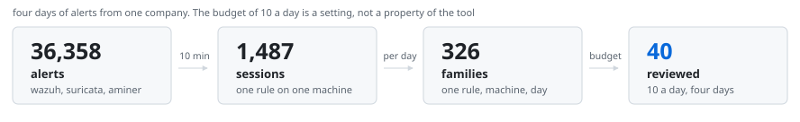

<p align="center">
  
</p>

<h1 align="center">meerkat</h1>

<p align="center">
  <strong>ML-assisted alert triage for multi-detector SOC data.</strong>
</p>

<p align="center">
  <a href="https://github.com/jiacwng/meerkat/actions/workflows/ci.yml">
    
  </a>
  
  
  
</p>

<p align="center">
  <a href="#quick-start">Quick start</a>
  &nbsp;&middot;&nbsp;
  <a href="docs/manual.md">Manual</a>
  &nbsp;&middot;&nbsp;
  <a href="#results">Results</a>
  &nbsp;&middot;&nbsp;
  <a href="docs/report/meerkat.pdf">Technical report</a>
</p>

## Overview

Wazuh, Suricata and a log anomaly detector each raise alerts on their own
severity scale, tens of thousands a day on a mid-sized network. None of them
ranks the others, so whoever looks first has to choose what to open. Meerkat
scores the day's alerts and builds a review queue sized to the time a team
actually has.

The measure it optimises is coverage at a budget: for a fixed number of cases
opened per day, how much of an attack does the queue point at. Ranking single
alerts fills a budget badly, because one step of an intrusion can raise
thousands of near-identical alerts while a privilege escalation raises three.

Commercial platforms already put an aggregation layer in front of the
analyst: Microsoft Sentinel groups alerts into incidents, and correlators
such as AIP's GraphWeaver join related alerts into incident graphs. Most
published ranking work starts from those incidents. An open-source detector
stack has no such layer, which leaves the question this project is about:

> **What should one item in the review queue be, so that limited review
> reaches as much of the attack as possible?**

Meerkat's answer is grouping before ranking: a **session** is one rule firing
on one machine until that stream is quiet for ten minutes, and a **family**
joins the same day's sessions that share a machine, a detector and a rule.
The queue holds each day's top families, and the **budget** is yours to set.

<p align="center">
  
</p>

A random forest scores each session, and a logistic regression ranks each
family from its sessions' scores, its shape and the role of the machine it
landed on. The forest retrains on your own incident records; the
[manual](docs/manual.md) covers what ships fixed and what is yours.

Meerkat is an open-source project built for research and learning. It does
not claim to replace a commercial triage platform. Its claims are in
[Results](#results) and their limits in [Limitations](#limitations).

## Quick start

Python 3.11 or newer, and Git LFS for the bundled example alerts.

```bash
git clone https://github.com/jiacwng/meerkat.git
cd meerkat
git lfs install && git lfs pull
python -m pip install -e .
meerkat demo
```

The clone contains a trained model and one company's alerts, so this runs with
no further download. Those alerts are part of the AIT Alert Data Set, under CC
BY 4.0; [NOTICE](NOTICE) records what is included. The first day's queue,
recorded:

```text
run russellmitchell-20260724-230029  |  company russellmitchell  |  budget 10  |  326 families
Review queue (top 10 per day, 2022-01-21)  |  F1 = top priority
┏━━━━━━━━┳━━━━━━━━━━━━┳━━━━━━━┳━━━━━━━━━━━━━━━┳━━━━━━━━━━┳━━━━━━━━━━━━━━━━━━━━━━━━━━━━━━━━━━━━━━━━━━┳━━━━━━━━┳━━━━━━━┳━━━━━━━━━┳━━━━━━━━┓
┃ handle ┃ date       ┃ start ┃ host          ┃ detector ┃ finding                                  ┃ alerts ┃ score ┃    esc% ┃ review ┃
┡━━━━━━━━╇━━━━━━━━━━━━╇━━━━━━━╇━━━━━━━━━━━━━━━╇━━━━━━━━━━╇━━━━━━━━━━━━━━━━━━━━━━━━━━━━━━━━━━━━━━━━━━╇━━━━━━━━╇━━━━━━━╇━━━━━━━━━╇━━━━━━━━┩
│ F1     │ 2022-01-21 │ 06:33 │ inet-firewall │ AMiner   │ AMiner: Unusual occurrence frequencies o │      6 │  1.00 │         │        │
│ F2     │ 2022-01-21 │ 11:27 │ inet-firewall │ AMiner   │ AMiner: New service_start parameter comb │      1 │  0.98 │         │        │
│ F3     │ 2022-01-21 │ 11:27 │ inet-firewall │ AMiner   │ AMiner: New service_stop parameter combi │      1 │  0.98 │         │        │
│ F4     │ 2022-01-21 │ 00:00 │ inet-firewall │ AMiner   │ AMiner: New ip address in DNS logs.      │     16 │  0.72 │         │        │
│ F5     │ 2022-01-21 │ 16:10 │ inet-firewall │ Suricata │ SURICATA HTTP gzip decompression failed  │      1 │  0.29 │         │        │
│ F6     │ 2022-01-21 │ 00:02 │ inet-firewall │ AMiner   │ AMiner: New event type.                  │      2 │  0.24 │         │        │
│ F7     │ 2022-01-21 │ 06:37 │ webserver     │ Suricata │ SURICATA TLS invalid record/traffic      │    105 │  0.19 │         │        │
│ F8     │ 2022-01-21 │ 05:24 │ inet-firewall │ Suricata │ SURICATA TLS invalid record/traffic      │    674 │  0.17 │         │        │
│ F9     │ 2022-01-21 │ 05:24 │ inet-firewall │ Suricata │ SURICATA TLS invalid handshake message   │    674 │  0.17 │         │        │
│ F10    │ 2022-01-21 │ 06:37 │ webserver     │ Suricata │ SURICATA TLS invalid handshake message   │    105 │  0.17 │         │        │
└────────┴────────────┴───────┴───────────────┴──────────┴──────────────────────────────────────────┴────────┴───────┴─────────┴────────┘
```

`score` sets the order. `esc%` fills in as you review: how often you escalated
your past reviewed families at the same score. It never changes the order, and
a fresh environment shows the score alone.

## From queue to decision

The daily loop, start to handoff:

```bash
meerkat inventory        # starter asset inventory from your alerts, once
meerkat check            # what triage will see; fix what it flags
meerkat triage           # score the batch into a run
meerkat browse           # work the queue: drill in, record decisions
meerkat export decisions # the review pass as a grid, for handoff
```

`inventory` writes the asset list the model reads machine roles from, once
per environment. `check` reports what triage will see and what to fix first.
`triage` scores the batch into a saved run, and every later command reopens
that run. `browse` is the review pass itself: open a family, read its
sessions and alerts, record the decision at the prompt. `export decisions`
turns the pass into a grid for handoff, one row per alert with the decision
it inherits. Along the way, `inspect` opens any family, session or single
alert with its evidence and the ATT&CK techniques observed on that machine,
and `export navigator` writes an
[ATT&CK Navigator](https://mitre-attack.github.io/attack-navigator/) layer.

The model itself retrains on your history:

```bash
meerkat retrain --incidents tickets.csv
```

refits the forest on your own alert archive, supervised by what your
investigations concluded. It asks for three things: an incident CSV meeting
the requirements in the manual, with about 15 distinct incidents as a
comfortable start; the alert archive those incidents happened in, since
`retrain` reads every alert file in the input directory; and the inventory,
because incident hosts are resolved through it. A retrain is saved
only when it beats the shipped model on your own held-out incidents, so it
can decline, and a declined retrain changes nothing.

Every command, flag and input format is in the [manual](docs/manual.md).

## Results

Measured on the [AIT Alert Data Set](https://zenodo.org/records/8263181): eight
simulated company networks in which a scripted attack was run and every alert it
produced was labelled. The model trains on seven networks and is scored on the
eighth, so the network being scored is never one it trained on.

Before any ranking, the grouping does the heavy lifting: an average company-day
of 56,899 alerts becomes 78 review items, and the item count stays between 59
and 86 while daily volume ranges from 9,012 to 109,497.

Coverage alone rewards big queues: the biggest families reach many attack
steps only because they hold most of the day's alerts. So every result
reports coverage beside what the queue costs to read.

Every row below works at the same budget, **K = 10: the analyst opens ten
families a day, ten reviews in total**. The comparison is what those ten
opened items reach:

| Ranking method | steps reached | alerts inside the queue | share of the day |
|---|---:|---:|---:|
| **Meerkat** | **58** | **29,597** | **25%** |
| Best single session in the family | 54 | 219,506 | 30% |
| Family size (alert count) | 30 | 284,595 | 93% |
| Detectors' own severity | 33 | 23,279 | 7% |
| Random order | 32 | 46,767 | 18% |
| Reviewing everything | 60 | 293,637 | 100% |

A step counts as reached only when the queue holds an alert labelled to it.
On steps alone the first two rows are close; Meerkat reads 4 to 7 times fewer
alerts for them. The last row reviews the whole day as one item and is the
ceiling. 60 of the 79 scripted steps are findable at all; without AMiner, 41
are, and Meerkat reaches all 41. Full tables and the tests behind every
comparison: [bench/README.md](bench/README.md).

The 25% arrives as ten review items a day, and a family is homogeneous by
its key: the same rule, on the same machine, on the same day, so one
judgement usually covers it. `inspect` shows the sessions inside, their
burst shape and the one field that varies between alerts, so a family of
7,068 firings is judged from a handful of sessions.

The [technical report](docs/report/meerkat.pdf) covers the method, the designs
that were dropped, and the limits of the evaluation.

## Limitations

- The results come from one simulated testbed whose networks share an attack
  script. They do not establish how the tool performs in production.
- An attack that trips the same rule as the surrounding noise, at the same
  severity and mixed in time with it, leaves nothing to separate.
- Ranking is by likelihood alone and carries no notion of business
  criticality. A critical server and a spare workstation showing identical
  activity score the same.
- Triage runs in batches, one complete day at a time. A real SOC works in
  shifts on a live stream, and meerkat does not fit that schedule.
- Wazuh, Suricata and AMiner are supported. Another detector needs an adapter.
- Retraining is only as good as the incident records a company can supply, and
  the shipped ranking weights stay unless `--refit-ranking-weights` beats them
  on your own held-out incidents.
- Below roughly 300 training sessions, drift reporting is mostly noise.

## Documentation

- [The manual](docs/manual.md): install, inputs, every command, the model.
- [bench/README.md](bench/README.md): reproducing the results table.
- [The technical report](docs/report/meerkat.pdf): the method, the designs
  that were dropped, and the limits of the evaluation.

## Citing

If you publish anything from these numbers, cite the dataset they were measured
on. `CITATION.cff` at the repository root carries the entries.

- M. Landauer, F. Skopik and M. Wurzenberger, *Introducing a New Alert Data Set
  for Multi-Step Attack Analysis*, CSET 2024.
- M. Landauer, F. Skopik, M. Frank, W. Hotwagner, M. Wurzenberger and A. Rauber,
  *Maintainable Log Datasets for Evaluation of Intrusion Detection Systems*,
  IEEE Transactions on Dependable and Secure Computing, 2023.

## License

MIT, see [LICENSE](LICENSE).

The repository ships part of the AIT Alert Data Set under CC BY 4.0, and a lookup
derived from MITRE ATT&CK. [NOTICE](NOTICE) carries both attributions.
