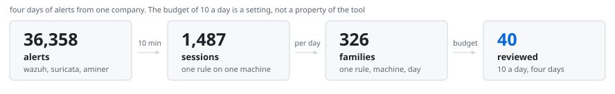

<p align="center">
  
</p>

<h1 align="center">meerkat</h1>

<p align="center">
  <strong>End-of-day alert triage for Wazuh.</strong>
</p>

<p align="center">
  <a href="https://github.com/jiacwng/meerkat/actions/workflows/ci.yml">
    
  </a>
  
  
</p>

<p align="center">
  <a href="#quick-start">Quick start</a>
  &nbsp;&middot;&nbsp;
  <a href="docs/manual.md">Manual</a>
  &nbsp;&middot;&nbsp;
  <a href="#results">Results</a>
</p>

## Overview

Meerkat reads a finished day of Wazuh alerts and builds a short review queue
for the next morning. Live monitoring handles urgent alerts as they fire.
Meerkat is the second pass over the whole day. It finds what a live shift
misses: one rule firing quietly on a machine for hours, or a host moving
through several ATT&CK tactics in one day.

Wazuh raises tens of thousands of alerts a day, on severity levels that do not
compare across rules. Suricata alerts arrive inside the Wazuh feed. AMiner, a
log anomaly detector, is an optional second source.

Commercial stacks group alerts into incidents before ranking them, as
Microsoft Sentinel and Defender XDR do. Wazuh has no such layer, which leaves
the question:

> **What should one item in the review queue be, so that limited review
> reaches as much of the attack as possible?**

Meerkat groups before ranking: a **session** is one rule firing on one machine
until it falls quiet for ten minutes, and a **family** joins the same day's
sessions sharing a machine, a detector and a rule. A random forest scores each
session, a logistic regression ranks each family, and the day's top families
are the queue. The budget is yours to set.

<p align="center">
  
</p>

## Quick start

Python 3.12 or newer, and Git LFS for the bundled example alerts.

```bash
git clone https://github.com/jiacwng/meerkat.git
cd meerkat
git lfs install && git lfs pull
python3 -m venv .venv && source .venv/bin/activate
python -m pip install -e .
meerkat demo
```

The clone contains a trained model and one company's alerts, so this runs with
no further download. Those alerts are part of the AIT Alert Data Set, under CC
BY 4.0; [NOTICE](NOTICE) records what is included. The first day's queue,
recorded:

```text
run russellmitchell-20261007-134440-786  |  company russellmitchell  |  budget 10  |  326 families
Review queue (top 10 per day, 2022-01-21)  |  F1 = top priority
┏━━━━━━━━┳━━━━━━━━━━━━┳━━━━━━━┳━━━━━━━━━━━━━━━━━┳━━━━━━━━━━┳━━━━━━━━━━┳━━━━━━━━━━━━━━━━━━━━━━━━━━━━━━━━━━━━━━━━━━┳━━━━━━━━━━━━━━━━━━━━━━━━━━━━━┳━━━━━━━━┳━━━━━━━┳━━━━━━━┳━━━━━━━━━┳━━━━━━━━┓
┃ handle ┃ date       ┃ start ┃ host            ┃ crit     ┃ detector ┃ finding                                  ┃ why                         ┃ alerts ┃ chain ┃ score ┃    esc% ┃ review ┃
┡━━━━━━━━╇━━━━━━━━━━━━╇━━━━━━━╇━━━━━━━━━━━━━━━━━╇━━━━━━━━━━╇━━━━━━━━━━╇━━━━━━━━━━━━━━━━━━━━━━━━━━━━━━━━━━━━━━━━━━╇━━━━━━━━━━━━━━━━━━━━━━━━━━━━━╇━━━━━━━━╇━━━━━━━╇━━━━━━━╇━━━━━━━━━╇━━━━━━━━┩
│ F1     │ 2022-01-21 │ 06:33 │ inet-firewall   │ critical │ AMiner   │ AMiner: Unusual occurrence frequencies o │ asset role firewall         │      6 │     2 │  1.00 │         │        │
│ F2     │ 2022-01-21 │ 11:27 │ inet-firewall   │ critical │ AMiner   │ AMiner: New service_start parameter comb │ asset role firewall         │      1 │     2 │  0.96 │         │        │
│ F3     │ 2022-01-21 │ 11:27 │ inet-firewall   │ critical │ AMiner   │ AMiner: New service_stop parameter combi │ asset role firewall         │      1 │     2 │  0.96 │         │        │
│ F4     │ 2022-01-21 │ 00:00 │ inet-firewall   │ critical │ AMiner   │ AMiner: New ip address in DNS logs.      │ asset role firewall         │     16 │     2 │  0.65 │         │        │
│ F5     │ 2022-01-21 │ 16:10 │ inet-firewall   │ critical │ Suricata │ SURICATA HTTP gzip decompression failed  │ asset role firewall         │      1 │       │  0.50 │         │        │
│ F6     │ 2022-01-21 │ 06:37 │ webserver       │ high     │ Suricata │ SURICATA TLS invalid record/traffic      │ detectors within 10 minutes │    105 │     1 │  0.20 │         │        │
│ F7     │ 2022-01-21 │ 06:37 │ webserver       │ high     │ Suricata │ SURICATA TLS invalid handshake message   │ detectors within 10 minutes │    105 │     1 │  0.18 │         │        │
│ F8     │ 2022-01-21 │ 06:33 │ intranet-server │ high     │ Suricata │ ET POLICY GNU/Linux APT User-Agent Outbo │ detectors within 10 minutes │      7 │     2 │  0.16 │         │        │
│ F9     │ 2022-01-21 │ 16:06 │ inet-firewall   │ critical │ Suricata │ SURICATA HTTP unable to match response t │ asset role firewall         │      8 │       │  0.16 │         │        │
│ F10    │ 2022-01-21 │ 06:37 │ mail            │ high     │ Suricata │ SURICATA TLS invalid record/traffic      │ detectors within 10 minutes │    105 │     1 │  0.15 │         │        │
└────────┴────────────┴───────┴─────────────────┴──────────┴──────────┴──────────────────────────────────────────┴─────────────────────────────┴────────┴───────┴───────┴─────────┴────────┘
```

`score` alone sets the order. `crit` is the asset's criticality, `why` the largest contribution to the score, and `chain` the length of the host's ATT&CK chain that day. `esc%` fills in as you review: how often you escalated your past reviewed families at the same score. A fresh environment shows the score alone.

## Using it

```bash
meerkat inventory        # asset inventory from your alerts, once
meerkat check            # what triage will see
meerkat pull --day 2026-10-06 --input alerts/2026-10-06  # each morning, yesterday
meerkat triage --input alerts/2026-10-06                 # score the day into a run
meerkat browse           # work the queue, record decisions
meerkat export decisions # the review pass as a grid
meerkat retrain --incidents tickets.csv  # refit on your own history
```

`inspect` opens any family, session or alert with its evidence and ATT&CK
techniques; `export navigator` writes an ATT&CK Navigator layer. Retraining
needs an incident CSV, the alert archive it covers, and the inventory, and it
saves a new model only when it beats the shipped one on your own held-out
incidents. The [manual](docs/manual.md) covers every command, flag and input
format.

## Results

Measured on the [AIT Alert Data Set](https://zenodo.org/records/8263181): eight
simulated company networks in which a scripted attack was run and every alert it
produced was labelled. The model trains on seven networks and is scored on the
eighth.

Before any ranking, the grouping does most of the reduction: an average
company-day of 56,899 alerts becomes 78 review items, and the item count stays
between 59 and 86 while the average day per network ranges from 9,012 to
109,497 alerts.

One queue item is a family: every alert of one rule, on one machine, over one
day. The key keeps the item uniform, so one judgement usually settles it, and
the sessions inside are there to open when it does not. The day's workload is
ten of these summaries. The alert column below is what sits underneath them,
opened on demand while investigating.

| Ranking method | steps reached (of 60) | items opened per day | alerts behind them, per day |
|---|---:|---:|---:|
| **Meerkat** | **58** | **10** | **14,660** |
| Detectors' own severity | 33 | 10 | 4,542 |

A step is one phase of the scripted attack on one machine, reached when the
queue holds an alert labelled to it. 60 of the 79 steps are findable at all.
At ten items a day, Meerkat reaches 58; the detectors' own severity ordering
reaches 33. Full tables and every baseline:
[bench/README.md](bench/README.md).

The busiest day in the test data, 453,697 alerts, triages in 72 seconds with
1.1 GB of memory on a machine with 12 cores and 7 GB of memory.

## Limitations

- The results come from one simulated testbed whose networks share an attack
  script. A second testbed (CAM-LDS) checks the transfer of the ranking weights
  only. Neither shows how the tool performs in production.
- A new site starts with the model trained on that testbed. Training on its
  own alerts needs a record of past incidents.
- An attack that fires the same rule as everyday noise, at the same severity
  and the same hours, gives meerkat nothing to tell them apart. It ranks with
  the noise.
- Ranking is by likelihood alone. Criticality and ATT&CK tactics are shown and
  filtered on but never change the order. The shipped ATT&CK mapping was built
  from the test data, so a score that used it could not be tested fairly.
- Wazuh, Suricata and AMiner are supported. Another detector needs an adapter.
- Retraining is only as good as the incident records a company can supply, and
  it keeps the shipped ranking weights.
- Below roughly 300 training sessions, drift reporting is mostly noise.

## Reference

- [Manual](docs/manual.md): install, inputs, commands, the model
- [Benchmark](bench/README.md): reproduce the results table

Cite the AIT Alert Data Set if you publish these numbers; `CITATION.cff` has
the entries. MIT licensed, see [LICENSE](LICENSE); [NOTICE](NOTICE) carries
the AIT and MITRE ATT&CK attributions.
